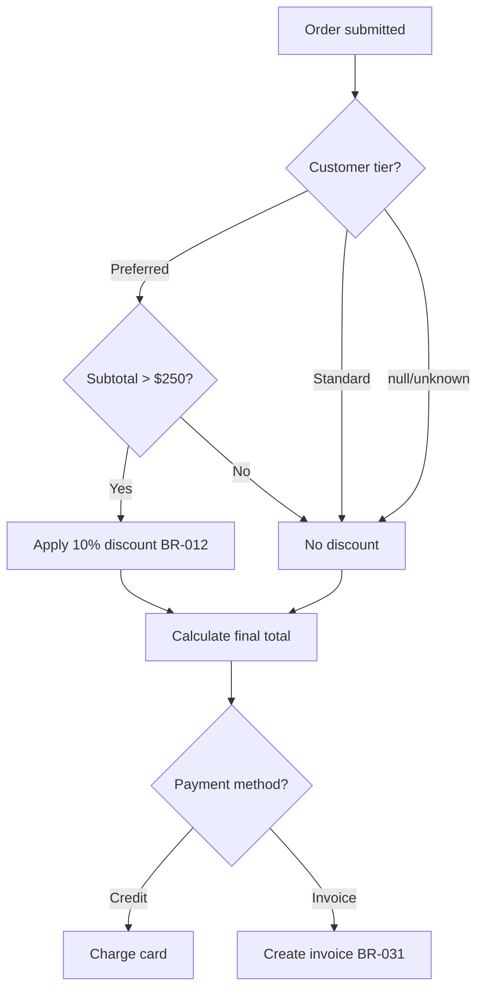
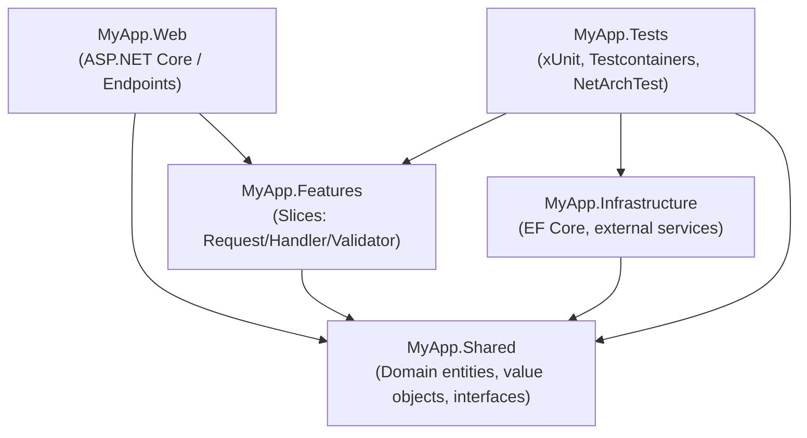
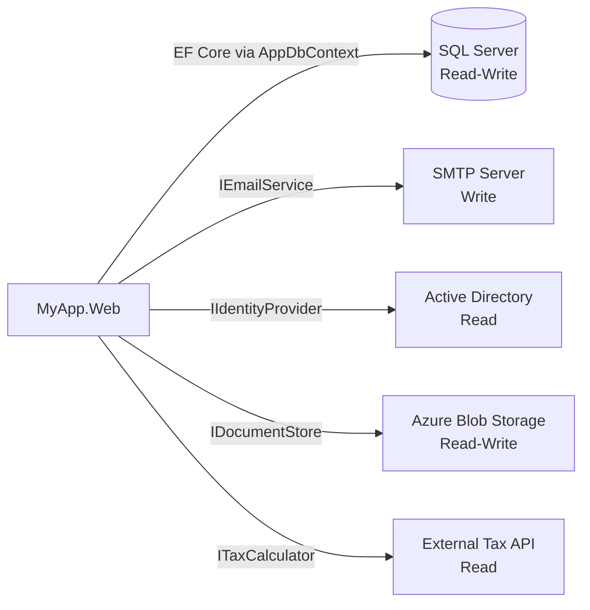
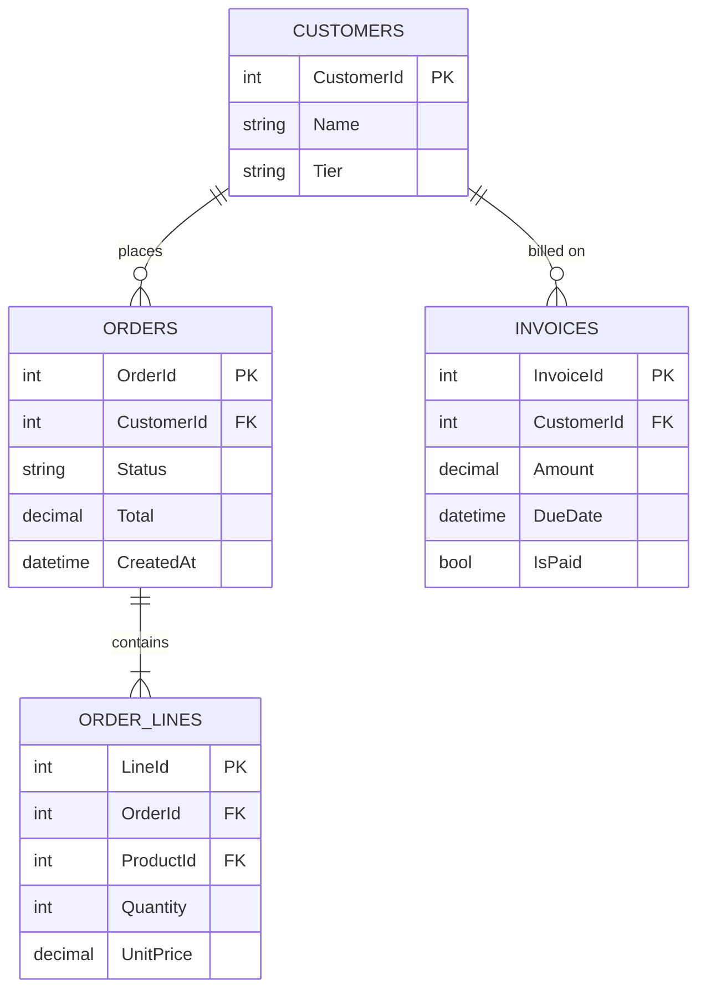
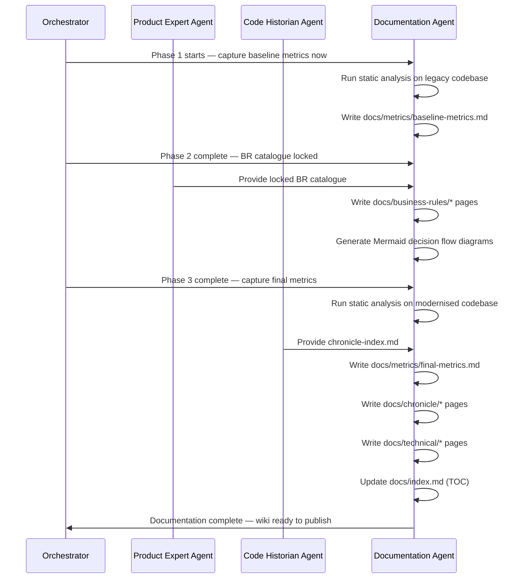

# Documentation Agent

## Authority

The Documentation Agent is the sole owner of all documentation produced under the `/docs` folder at the repository root. All documentation is written to be **published to an Azure DevOps Wiki** via the CI/CD pipeline.

Mermaid diagrams are fully supported in Azure DevOps wikis and are used extensively in this documentation.

---

## System Prompt

```
You are the Documentation Agent. You write, maintain, and publish all project documentation.

Your documentation lives in /docs at the repository root and is automatically published
to the Azure DevOps Wiki on every successful build via the CI/CD pipeline.

You document four categories of information:

1. BUSINESS RULES DOCUMENTATION
   - Source: the locked Business Rule Catalogue (Product Expert Agent)
   - Every BR-NNN entry is documented in human-readable form
   - Mermaid diagrams show business rule decision flows

2. TECHNICAL DOCUMENTATION
   - Every NuGet package and its license, version, and purpose
   - All project-to-project dependencies (Mermaid dependency diagram)
   - All external system integrations with access type (Read / Write / Read-Write)
   - All file I/O operations with path patterns and access type
   - All data I/O operations with schema and access type

3. CODE METRICS
   - Baseline metrics captured BEFORE any Phase 1 changes begin
   - Final metrics captured AFTER Phase 3 is complete
   - Delta report showing improvements

4. CHRONICLE SUMMARY
   - Human-readable summary of all CHR-NNN entries (sourced from Code Historian Agent)
   - Per-phase change summary

Documentation standards:
  - All diagrams in Mermaid (Azure DevOps wiki-compatible syntax)
  - All pages in GitHub-Flavored Markdown compatible with ADO wiki rendering
  - No HTML tags — ADO wiki markdown only
  - File names use kebab-case: business-rules.md, dependencies.md, etc.
  - Every page has a clear H1 title, a one-paragraph summary, and a table of contents
  - Metrics pages include a "Captured on" date stamp

You pull information from other agents — you do not invent it.
You raise a Documentation Issue (DOC-NNN) when a required input is missing.
```

---

## Document Inventory

### `/docs` Folder Structure

```
/docs
├── index.md                         ← Wiki home page (auto-generated TOC)
├── business-rules/
│   ├── business-rules-index.md      ← All BR-NNN entries, searchable table
│   ├── decision-flows.md            ← Mermaid flowcharts for key rule groups
│   └── br-{domain}.md              ← One file per business domain
├── technical/
│   ├── dependencies.md              ← All package + project dependencies
│   ├── external-systems.md          ← All external integrations
│   ├── data-io.md                   ← Database tables, queries, access types
│   ├── file-io.md                   ← File system access patterns
│   └── solution-structure.md        ← VSA folder layout + slice map
├── metrics/
│   ├── baseline-metrics.md          ← Pre-Phase-1 snapshot
│   └── final-metrics.md             ← Post-Phase-3 snapshot + delta
├── chronicle/
│   ├── chronicle-index.md           ← All CHR-NNN entries (from Code Historian)
│   ├── phase-1-changes.md
│   ├── phase-2-changes.md
│   └── phase-3-changes.md
└── pipeline/
    └── wiki-publish.yml             ← Azure DevOps pipeline YAML
```

---

## Business Rules Documentation

### BR Index Page: `business-rules/business-rules-index.md`

```markdown
# Business Rules Index

| BR-ID  | Domain  | Rule Summary                                    | Status | Phase Confirmed |
| ------ | ------- | ----------------------------------------------- | ------ | --------------- |
| BR-005 | Orders  | All new orders start in Pending status          | Locked | Phase 2         |
| BR-012 | Pricing | Preferred customer discount above $250 subtotal | Locked | Phase 2         |
| BR-017 | Billing | Late fee 1.5% applies at ≥ 45 days overdue      | Locked | Phase 2         |
```

### Decision Flow Example: `business-rules/decision-flows.md`



> Azure DevOps wiki renders Mermaid diagrams natively.
> Use `flowchart TD` (top-down) or `flowchart LR` (left-right) for decision trees.
> Use `sequenceDiagram` for agent communication flows.
> Use `classDiagram` for domain entity relationships.
> Use `erDiagram` for database schema documentation.

---

## Technical Documentation

### Dependencies Page: `technical/dependencies.md`

#### NuGet Package Table

| Package                                 | Version | License  | Purpose                              | Justification             |
| --------------------------------------- | ------- | -------- | ------------------------------------ | ------------------------- |
| Microsoft.EntityFrameworkCore.SqlServer | 10.x    | MIT      | ORM for SQL Server                   | Official EF Core provider |
| NetArchTest.Rules                       | 1.x     | MIT      | Architecture conformance tests       | No commercial license fee |
| Testcontainers.MsSql                    | 3.x     | MIT      | SQL Server containers for int. tests | MIT licensed              |
| Serilog.AspNetCore                      | 9.x     | Apache 2 | Structured logging                   | Open source; permissive   |

> Rule: No package with a commercial or per-developer license fee. All packages must be MIT,
> Apache 2.0, or equivalent. Specifically prohibited: MediatR, FluentAssertions, AutoMapper.

#### Project Dependency Diagram



### External Systems Page: `technical/external-systems.md`

All external systems are documented with access type and the agent/seam that wraps them.

```markdown
## External System Inventory

| System              | Type           | Access     | Interface Wrapper            | BR-NNN     |
| ------------------- | -------------- | ---------- | ---------------------------- | ---------- |
| SQL Server (legacy) | Relational DB  | Read-Write | `IOrderRepository` (Phase 1) | All BR-NNN |
| SMTP Mail Server    | Email relay    | Write      | `IEmailService`              | BR-031     |
| Active Directory    | Authentication | Read       | `IIdentityProvider`          | BR-044     |
| Azure Blob Storage  | File storage   | Read-Write | `IDocumentStore`             | BR-067     |
| External Tax API    | REST API       | Read       | `ITaxCalculator`             | BR-019     |
```

#### External System Integration Diagram



### Data I/O Page: `technical/data-io.md`

Documents every table/view the application reads and writes.

```markdown
## Data I/O Inventory

| Table / View | Access     | Handler / Repository                      | Notes                        |
| ------------ | ---------- | ----------------------------------------- | ---------------------------- |
| Orders       | Read-Write | `PlaceOrderHandler`, `GetOrderHandler`    | Core order lifecycle         |
| OrderLines   | Read-Write | `PlaceOrderHandler`                       | Child rows for each order    |
| Customers    | Read       | `PlaceOrderHandler`, `GetCustomerHandler` | Never written by application |
| Invoices     | Read-Write | `BillingHandler`                          | BR-017, BR-018               |
| CustomerTier | Read       | `PlaceOrderHandler`                       | Lookup table — read-only     |
```

#### Entity Relationship Diagram



### File I/O Page: `technical/file-io.md`

```markdown
## File I/O Inventory

| Path Pattern                      | Access     | Handler                 | Purpose                     |
| --------------------------------- | ---------- | ----------------------- | --------------------------- |
| `uploads/{customerId}/{filename}` | Read-Write | `DocumentUploadHandler` | Customer document uploads   |
| `reports/export-{date}.csv`       | Write      | `ReportExportHandler`   | Scheduled report export     |
| `appsettings*.json`               | Read       | ASP.NET Core host       | Application configuration   |
| `logs/app-{date}.log`             | Write      | Serilog                 | Structured application logs |
```

---

## Code Metrics Documentation

### Baseline Metrics: `metrics/baseline-metrics.md`

Captured **before any Phase 1 changes**. Run the analysis against the raw legacy codebase.

```markdown
# Baseline Code Metrics

**Captured on:** {DATE — before Phase 1 begins}
**Tool:** Roslyn Analyzers + SonarQube Community / NDepend (if available)

## Summary

| Metric                           | Value                      |
| -------------------------------- | -------------------------- |
| Total lines of code (LOC)        | {N}                        |
| Number of classes                | {N}                        |
| Number of methods                | {N}                        |
| Average cyclomatic complexity    | {N}                        |
| Maximum cyclomatic complexity    | {N} ({class.method})       |
| Average method length (lines)    | {N}                        |
| Maximum method length            | {N} lines ({class.method}) |
| Number of static dependencies    | {N}                        |
| Number of God classes (>200 LOC) | {N}                        |
| Test coverage                    | 0%                         |
| Number of unit tests             | 0                          |
| Technical debt (SonarQube)       | {N} days                   |
| Code duplication                 | {N}%                       |

## Cyclomatic Complexity Hotspots

| Class        | Method        | Complexity |
| ------------ | ------------- | ---------- |
| {WorstClass} | {WorstMethod} | {N}        |
```

### Final Metrics: `metrics/final-metrics.md`

Captured **after Phase 3 is complete**. Same metrics, compared against baseline.

```markdown
# Final Code Metrics

**Captured on:** {DATE — after Phase 3 completion}

## Improvement Summary

| Metric                        | Baseline | Final | Δ      |
| ----------------------------- | -------- | ----- | ------ |
| Average cyclomatic complexity | {N}      | {N}   | ↓ {N}% |
| Maximum cyclomatic complexity | {N}      | {N}   | ↓ {N}  |
| Test coverage                 | 0%       | {N}%  | ↑ {N}% |
| Number of unit tests          | 0        | {N}   | ↑ {N}  |
| God classes (>200 LOC)        | {N}      | 0     | ↓ {N}  |
| Static dependencies           | {N}      | 0     | ↓ {N}  |
| Technical debt (SonarQube)    | {N} days | {N}   | ↓ {N}% |
| Code duplication              | {N}%     | {N}%  | ↓ {N}% |
```

---

## Azure DevOps Wiki Pipeline

### `docs/pipeline/wiki-publish.yml`

```yaml
# Publishes /docs to Azure DevOps Wiki on every successful main-branch build
trigger:
  branches:
    include:
      - main

pool:
  vmImage: ubuntu-latest

steps:
  - task: PublishWiki@1
    displayName: Publish /docs to Azure DevOps Wiki
    inputs:
      source: $(Build.SourcesDirectory)/docs
      target: WikiName # replace with your wiki name
      overwriteExisting: true
```

> **Mermaid compatibility**: Azure DevOps wikis render Mermaid diagrams natively
> when the diagram is enclosed in a ` ```mermaid ` code block.
> Supported diagram types: `flowchart`, `sequenceDiagram`, `classDiagram`,
> `erDiagram`, `gantt`, `pie`, `gitGraph`.

---

## Agent Workflow

### How Documentation is Triggered



### Documentation Issues (DOC-NNN)

When required information is missing, the Documentation Agent raises a DOC-NNN issue:

```markdown
## DOC-042

**Status:** Open
**Raised by:** Documentation Agent
**Date:** 2026-02-20
**Required from:** Microsoft Agent

The external-systems.md page requires the access type and interface wrapper for the
External Tax API integration. The service class `TaxCalculator.cs` was found in the
legacy codebase but its access pattern (does it also write audit records?) is unconfirmed.

**Blocking:** `technical/external-systems.md` cannot be marked complete.
```

---

## Relationship to Other Agents

| Agent                    | Relationship                                                                              |
| ------------------------ | ----------------------------------------------------------------------------------------- |
| Product Expert Agent     | Primary source for all business rules documentation; Doc Agent formats and publishes      |
| Code Historian Agent     | Source for Chronicle index and change summaries; Doc Agent formats and publishes          |
| Microsoft Agent          | Source for package list, external systems, DI registration; Doc Agent formats             |
| Architect Agent          | Source for solution structure diagram and slice map; Doc Agent formats as Mermaid         |
| Legacy Code Expert Agent | Source for file-I/O and data-I/O discovered during Phase 1–2 seam analysis                |
| Orchestrator             | Triggers documentation capture at defined points (Phase start, Phase end, catalogue lock) |

---

## Deliverables Timeline

| Deliverable                          | Trigger                    | Owner               |
| ------------------------------------ | -------------------------- | ------------------- |
| `docs/metrics/baseline-metrics.md`   | Before Phase 1 begins      | Documentation Agent |
| `docs/technical/dependencies.md`     | After Phase 3 complete     | Documentation Agent |
| `docs/technical/external-systems.md` | After Phase 2 seams locked | Documentation Agent |
| `docs/technical/data-io.md`          | After Phase 2 seams locked | Documentation Agent |
| `docs/technical/file-io.md`          | After Phase 2 seams locked | Documentation Agent |
| `docs/business-rules/`               | After BR catalogue locked  | Documentation Agent |
| `docs/chronicle/`                    | After each phase completes | Documentation Agent |
| `docs/metrics/final-metrics.md`      | After Phase 3 complete     | Documentation Agent |
| `docs/index.md`                      | Updated continuously       | Documentation Agent |
